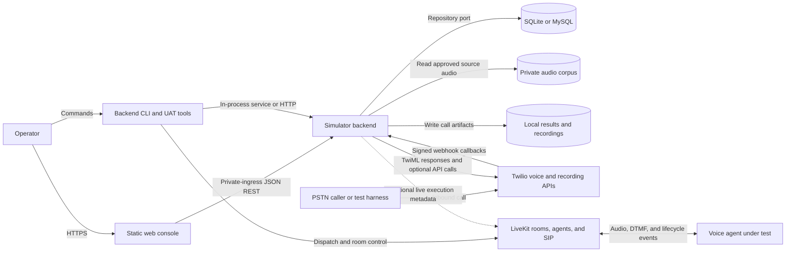
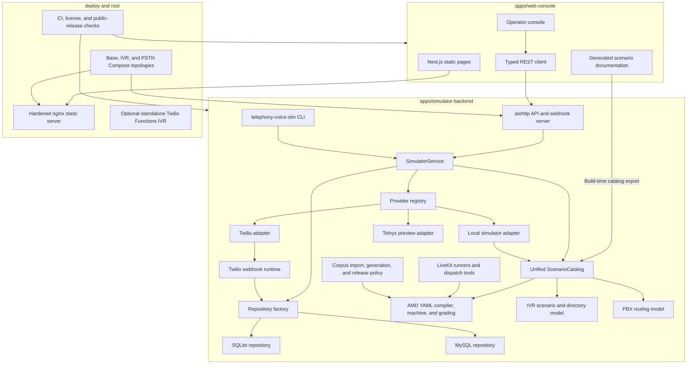
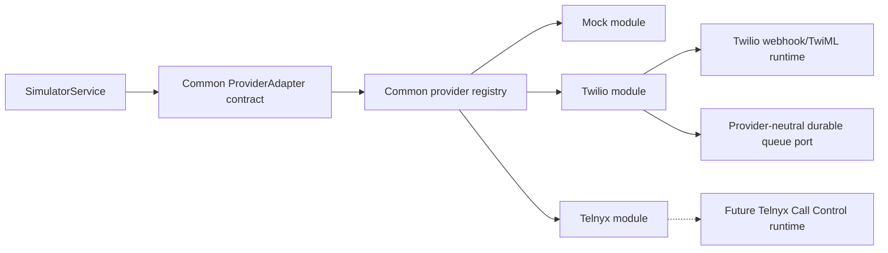
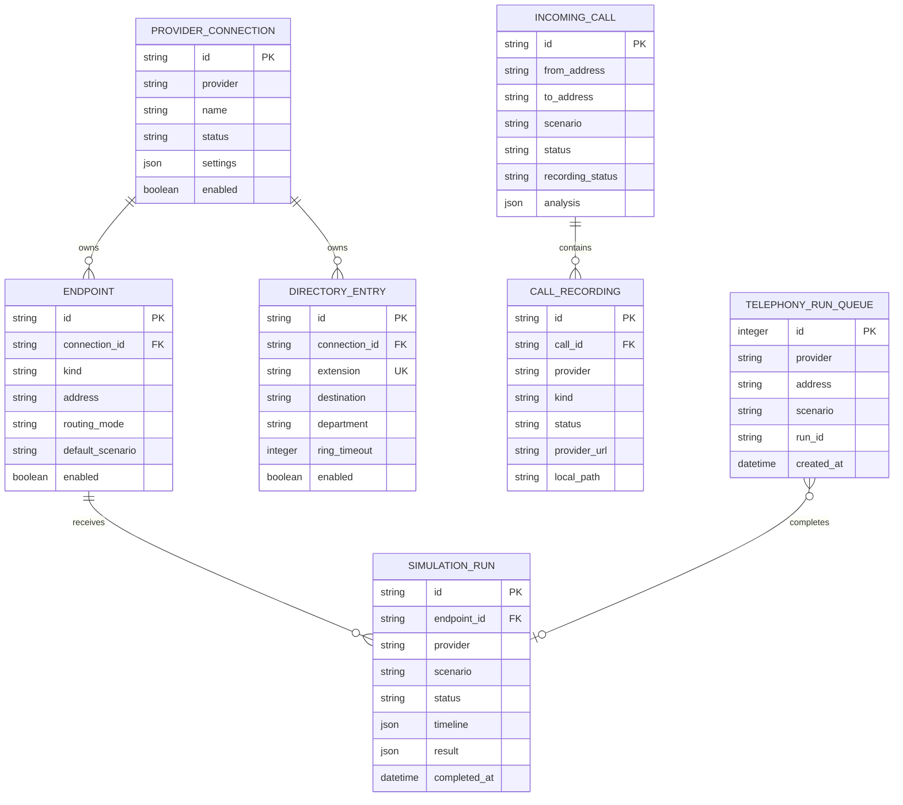
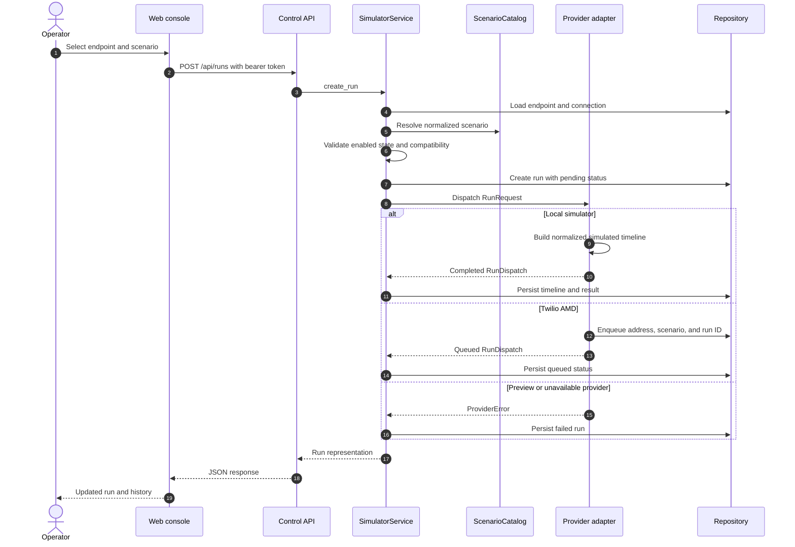
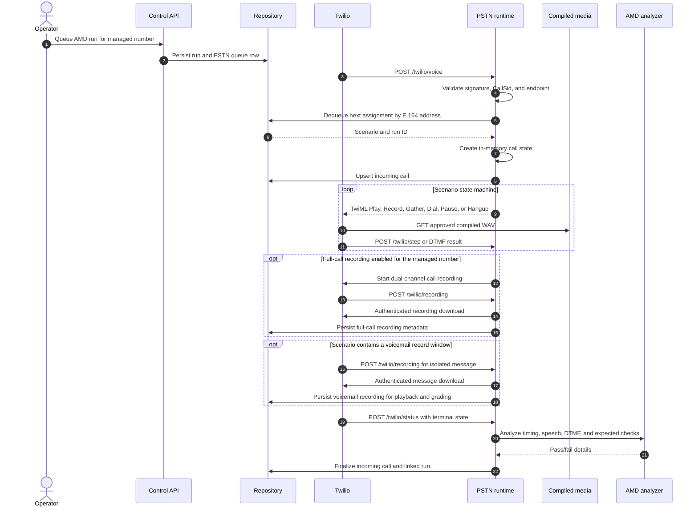
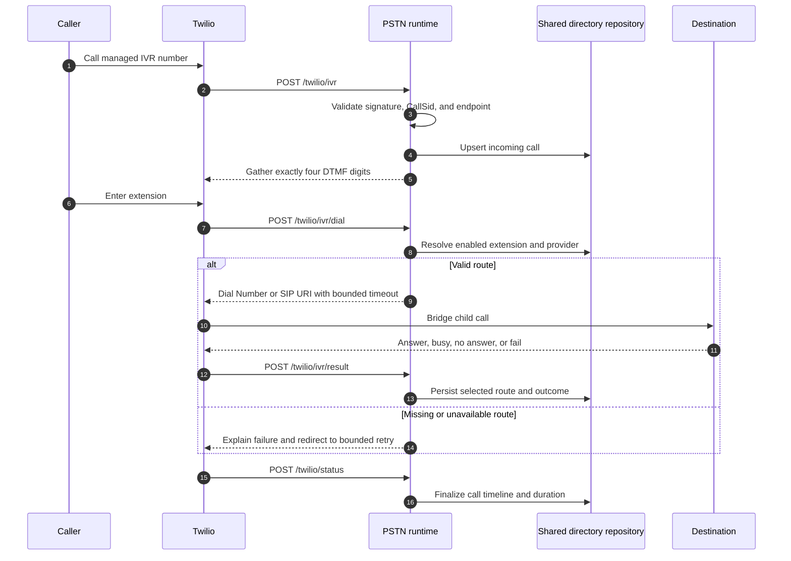
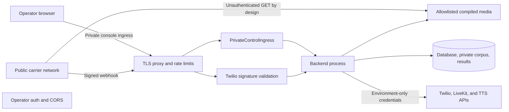
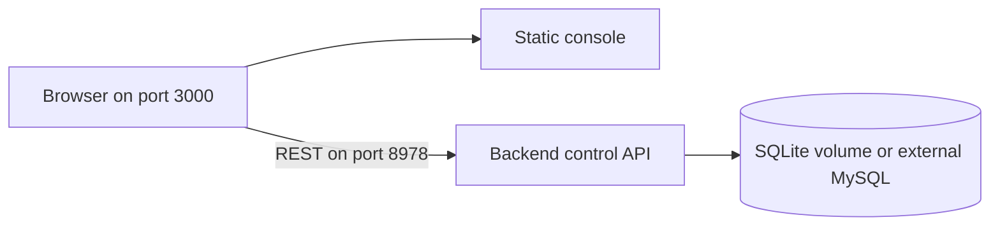

# High-level design

Last reviewed: 2026-07-26.

## 1. Purpose

Telephony Voice Simulator is a local-first platform for exercising the call
boundary around a voice agent or telephony application. It combines:

- answering-machine detection and voicemail behavior;
- inbound IVR and extension routing;
- deterministic PBX routing models;
- local, LiveKit, and Twilio execution paths;
- call timelines, recordings, analysis, and grading;
- an operator API, CLI, and static web console.

The project has one backend source of truth and one replaceable web client.
AMD is a scenario domain on top of the telephony platform, not a separate
application.

## 2. Scope and non-goals

### In scope

- Define reusable AMD, IVR, and PBX scenarios.
- Run scenarios without credentials through the local simulator.
- Queue an AMD scenario for the next inbound call to a managed Twilio number.
- Answer a Twilio call as an IVR and bridge a four-digit extension.
- Exercise LiveKit room-mode or deployed-agent workflows through operational
  CLIs.
- Persist provider configuration, endpoints, directory routes, runs, calls,
  recording metadata, and analysis.
- Publish static scenario documentation and an operator console.
- Package the backend, static console, and container topologies without
  publishing the private audio corpus.

### Not in scope

- Acting as a production SIP registrar or PBX.
- High-volume, multi-region carrier traffic.
- A distributed job queue or horizontally shared call-state service.
- Automatically deleting provider-hosted recordings.
- Providing public redistribution rights for the local audio corpus.
- Live Telnyx Call Control execution; the current Telnyx adapter is a preview
  contract.

## 3. Architectural principles

1. **One control plane.** The API and CLI call the same application service,
   catalog, provider registry, and repository contract.
2. **Scenario packs, not application forks.** AMD, IVR, and PBX keep their
   domain-specific execution rules but share endpoints, providers, runs, and
   normalized timelines.
3. **Provider isolation.** Carrier-specific dispatch stays behind adapters or
   the PSTN boundary.
4. **Static, replaceable UI.** The console has no server-side business logic.
5. **Replaceable persistence.** SQLite keeps local setup small; a MySQL URI
   enables permanent/shared relational storage without changing services or
   provider modules.
6. **Fail closed at public boundaries.** Public webhook mode requires HTTPS,
   Twilio signature verification, operator authentication, and explicit audio
   approval.
7. **Private media by default.** Audio is generated or mounted separately and
   is not part of normal Git, wheel, web, or Docker artifacts.

## 4. System context

The primary product boundary is the backend. Twilio and LiveKit are optional
execution environments; the local simulator remains fully credential-free.

## 5. Repository containers

### Application responsibilities

| Component | Responsibility |
|---|---|
| Web console | Operator workflows for providers, endpoints, directory routes, scenarios, runs, calls, and recordings |
| Static scenario docs | Human-readable reference generated from the backend catalog |
| HTTP API | Authentication, CORS, validation/error translation, CRUD, dispatch, history, and media access |
| CLI | The same control-plane operations without a browser, plus model simulation and server startup |
| `SimulatorService` | Business validation and orchestration shared by API and CLI |
| `ScenarioCatalog` | Presents AMD YAML and built-in IVR/PBX definitions through one schema |
| Provider registry | Maps provider keys to capability descriptors and dispatch adapters |
| Repository factory | Selects SQLite by default or MySQL from `SIMULATOR_DATABASE_URI` |
| SQLite/MySQL repositories | Schema, migrations, persistence, provider queues, ownership records, and tombstones |
| PSTN runtime | Twilio webhook validation, TwiML state progression, live IVR, recording callbacks, and call finalization |
| AMD runtime | Compiles audio/state-machine steps, handles DTMF, and grades observed behavior |
| IVR/PBX domains | Deterministic routing and timeline models independent of a carrier |
| Corpus tooling | Imports or generates local media and enforces provenance/release policy |

### Provider boundary

The common `telephony` package owns only contracts and composition. Twilio
owns its E.164 uniqueness rules, readiness checks, queue dispatch, webhook
validation, TwiML, recording callbacks, and queue invalidation. Telnyx owns
its endpoint rules and preview capability declaration. Neither carrier module
imports the other, and the service does not contain carrier-name branches.

## 6. Core domain model

Two additional append-only protection tables are intentionally outside the
normal ownership graph:

- `managed_provider_addresses` remembers every address ever managed by each
  carrier module. Deleting an endpoint cannot make a Twilio number silently
  fall back to an unmanaged route. The SQLite migration copies and then
  removes the former Twilio-only ownership and queue tables.
- `deleted_incoming_calls` tombstones deleted call IDs. Late carrier callbacks
  cannot recreate a call or its files after an operator deletes it.

## 7. Scenario model

The catalog normalizes three different packs:

| Pack | Definition | Execution |
|---|---|---|
| AMD | YAML state machines containing wait, play, tone, record, DTMF, dial, repeat, and hang-up steps | Local machine, Twilio PSTN machine, hosted Twilio machine, or LiveKit runner |
| IVR | Built-in scenario definitions and free-form directory calls | Local deterministic timeline or live Twilio gather/dial |
| PBX | Built-in departments, extensions, schedules, queues, states, CRM events, and CDR outcomes | Local deterministic timeline |

Every catalog entry exposes a provider-neutral identity, kind, description,
sequence/timeline information, and expected behavior. The service checks
provider compatibility before creating a run.

Endpoint routing controls how a scenario is selected:

- `fixed`: the endpoint's configured default scenario wins and cannot be
  overridden by an ad-hoc run request;
- `queued`: a run may select a scenario for the next call, falling back to the
  endpoint default only when no per-run scenario is supplied.

## 8. End-to-end control-plane flow

The console uses ordinary REST requests. It does not own execution state, and
there is no WebSocket dependency.

## 9. Live AMD call flow

Important selection and safety rules:

- queued one-shot assignments take precedence over static/default behavior;
- canonical E.164 matching prevents formatting differences from creating a
  second identity;
- only active compiled filenames are served from `/assets`;
- deleted or disabled managed endpoints remain fail-closed;
- public AMD startup fails before binding unless every referenced source asset
  is present, checksum-bound, provenance-reviewed, and deployment-allowlisted.

## 10. Live IVR flow

The IVR and console share the same directory table. An operator change is
therefore immediately visible to the live IVR without duplicating configuration
in a Function or frontend database.

## 11. LiveKit and hosted alternatives

These are operational paths, not duplicate control planes:

### LiveKit room mode

1. The runner loads one AMD YAML scenario and starts its local callee machine.
2. It joins a LiveKit room and exchanges audio with the agent under test.
3. It observes the agent track, DTMF, lifecycle events, and optional webhooks.
4. The assertion engine grades speech timing, overlap, message content, and
   scenario-specific expectations.
5. It writes a result bundle under the configured results directory.

### Deployed LiveKit agent mode

1. The dispatch tool renders a provider-neutral metadata template.
2. LiveKit starts the named deployed agent.
3. The agent places a SIP/PSTN call to the simulator number.
4. The selected Twilio AMD scenario executes through the normal PSTN boundary.
5. The UAT/grading tools correlate remote lifecycle data with simulator
   artifacts.

### Hosted Twilio AMD

The optional hosted machine deploys scenario programs and approved media into
Twilio Serverless and uses Twilio Sync for queue/call documents. It has its own
deployment and grading CLIs. The web console controls the unified backend
queue; it does not enqueue the hosted Sync machine.

### Standalone Twilio Functions IVR

The optional Function is useful when a completely Twilio-hosted IVR is needed.
Its environment-backed extension directory is separate from the repository. Use the
unified `/twilio/ivr` runtime when console-managed directory changes must be
shared live.

## 12. API surface

| Area | Representative routes |
|---|---|
| Health | `GET /health` |
| Provider catalog and connections | `GET /api/providers/catalog`, CRUD under `/api/providers` |
| Endpoints | CRUD under `/api/endpoints` |
| Directory | CRUD under `/api/directory` |
| Scenarios and runs | `GET /api/scenarios`, `GET/POST /api/runs` |
| Deterministic IVR simulation | `POST /api/ivr/simulations` |
| Compatibility | `POST /api/simulations` |
| Calls and recordings | `GET /api/calls`, call deletion, private-ingress recording media |
| Twilio AMD | `/twilio/voice`, `/twilio/step`, `/twilio/recording`, `/twilio/status` |
| Twilio IVR | `/twilio/ivr`, `/twilio/ivr/dial`, `/twilio/ivr/result` |
| Approved compiled media | `GET /assets/{filename}` |

The CLI exposes the same control-plane concepts and preserves the compatibility
entry points `amd-sim` and `telephony-sim`.

## 13. Trust boundaries and security

### Controls

- Operator APIs and the console stay on loopback or private authenticated
  ingress; public carrier ingress never forwards `/api/*`.
- CORS allows only configured console origins.
- Twilio callbacks require signature validation. Unsigned callbacks are an
  explicit loopback-only test override.
- `PUBLIC_BASE_URL` must be absolute HTTPS outside isolated local testing.
- Call IDs and recording paths are validated and confined below the owned
  results directory.
- Recording is off by default.
- Provider-hosted recordings have a separate retention/deletion lifecycle.
- Public AMD media requires a distinct acknowledgement, manifest provenance,
  SHA-256 values, and an exact deployment allowlist.
- Secrets and private audio are excluded from normal source and runtime
  artifacts.

## 14. Deployment topologies

### Control-only local or container mode

This mode supports catalog browsing, CRUD, local simulator execution, deterministic
IVR/PBX simulation, and history without exposing carrier webhooks.

### IVR-only public mode

The base Compose file plus `compose.ivr.yaml` adds signed Twilio IVR routes.
It does not load or expose the AMD corpus.

### Combined PSTN mode

The base Compose file plus `compose.pstn.yaml` adds both AMD and IVR webhook
routes. A rights-reviewed corpus is mounted read-only. Compiled media is written
under runtime data and served only when the public-audio gate succeeds.

For every public mode, TLS and request/rate limits belong at a trusted reverse
proxy. Database access, corpus sources, and result directories remain private.

## 15. Runtime state and lifecycle

| State | Location | Restart behavior |
|---|---|---|
| Provider connections, endpoints, directory | SQLite or MySQL | Durable |
| Simulation runs and provider queue | SQLite or MySQL | Durable |
| Incoming calls and recording metadata | SQLite or MySQL | Durable |
| Managed-address history and deletion tombstones | SQLite or MySQL | Durable and append-only |
| Active TwiML machine state | Backend memory | Not fully recoverable; persisted rows permit fail-safe terminal handling, but active execution must remain on one process |
| Compiled AMD media | Runtime data directory | Regenerated at AMD startup; stale WAVs are removed first |
| Downloaded recordings and call JSON | Results directory | Durable when the directory is persisted |
| Static scenario reference | Web build output | Regenerated from backend source at build time |

SQLite mode assumes one backend writer. MySQL supports durable shared records,
but active calls still require one process owner because TwiML execution state
is currently in memory. The static web tier may be replicated independently.

## 16. Failure handling

| Failure | Behavior |
|---|---|
| Unknown or incompatible scenario | Request rejected before provider dispatch |
| Disabled provider or endpoint | Request or inbound call fails closed |
| Endpoint/provider changed with queued calls | Affected queue rows and linked runs are failed with a reason |
| Duplicate Twilio number | Rejected globally across Twilio connections |
| Missing private AMD corpus | AMD mode refuses startup; IVR-only mode remains available |
| Invalid webhook signature or CallSid | Callback rejected |
| Deleted call receives late callback | Tombstone prevents recreation |
| Carrier retry sends the same call | Existing call state is reused where possible |
| Recording download fails | Call metadata remains; analysis reports missing evidence |
| Provider adapter fails dispatch | Run is persisted as failed |
| Invalid extension or no DTMF | Bounded IVR retry, then hang-up |
| Hosted build does not finish | Deployment polling times out and fails closed |

## 17. Scalability and availability

The existing architecture is deliberately optimized for engineering labs,
continuous integration, and controlled UAT:

- aiohttp supports concurrent API and webhook requests in one process;
- SQLite provides local durability without an external service; MySQL is
  available when permanent/shared relational storage is required;
- the console is static and can be cached or replicated freely;
- call media and analysis are local filesystem workloads.

It is not safe to scale the backend horizontally over the same call set because
active TwiML state is process-local and the run queue is not yet a leased
distributed work queue. A production-scale evolution would add:

1. managed MySQL with backups, TLS, rotation, and migration operations;
2. a transactional broker or database-backed lease for provider queues;
3. in-memory active calls with a durable state machine;
4. local recordings/results with encrypted object storage;
5. process logs with structured logs, metrics, traces, and alerts.

Those changes can preserve the API, scenario, service, and provider boundaries.

## 18. Observability

Currently available:

- `/health` and container health checks;
- normalized run timelines and result JSON;
- incoming-call status, duration, route, and analysis;
- recording metadata;
- call result bundles and UAT artifacts;
- provider runtime readiness messages.

Recommended before operating real traffic:

- structured JSON logging with a shared run ID and CallSid;
- request latency, webhook rejection, queue depth, call outcome, and analysis
  metrics;
- distributed traces across reverse proxy, webhook, provider API, and
  recording download;
- alerts for stuck queues, signature failures, missing recordings, and public
  audio policy rejection.

## 19. Key design decisions and tradeoffs

| Decision | Benefit | Tradeoff |
|---|---|---|
| One Python backend | No duplicated API, schema, or business rules | Python process is the central runtime dependency |
| Static Next.js console | Simple, replaceable, and easy to host | API origin is fixed at build time |
| SQLite default plus MySQL URI | Zero-service local setup and an upgrade path to permanent storage | MySQL operations still require external backup, TLS, and availability controls |
| Provider adapter interface | Carrier behavior does not leak into scenario packs | Live providers still need provider-specific operational code |
| YAML AMD scenarios | Reviewable and portable state machines | Media provenance must be managed separately |
| Deterministic IVR/PBX models | Fast, repeatable CI and product testing | Not a substitute for a live SIP/PBX stack |
| Separate IVR and AMD routes | Clear runtime and audio security boundaries | One Twilio number can point to only one Voice URL at a time |
| Public media allowlist | Twilio can fetch only reviewed compiled assets | Public AMD needs an explicit rights-review workflow |

## 20. Extension points

### Add a provider

1. Implement `ProviderAdapter`.
2. Declare capabilities and supported endpoint kinds.
3. Validate which normalized scenario kinds it supports.
4. Register it in `provider_registry`.
5. Add runtime configuration, tests, and operator copy.

### Add a scenario

- AMD: add a validated YAML state machine plus manifest-backed local assets.
- IVR/PBX: add a domain definition that emits normalized sequences/timelines.
- Run catalog lint, content generation, backend tests, and the web build.

### Add live PBX or SIP execution

Keep the existing PBX pack as the expected-behavior model and add a provider
adapter that converts its normalized routing intent into live SIP/PBX actions.
Do not introduce a third application or duplicate the catalog/store.

## 21. Source map

| Concern | Primary source |
|---|---|
| API and middleware | `control/api.py` |
| Business orchestration | `control/service.py` |
| Persistence and queues | `control/store.py` |
| Database selection and MySQL | `control/database.py`, `control/mysql_store.py` |
| Common provider contract/registry | `telephony/base.py`, `telephony/registry.py` |
| Twilio provider module | `telephony/providers/twilio/` |
| Telnyx provider module | `telephony/providers/telnyx.py` |
| Unified catalog | `control/catalog.py` |
| CLI and runtime modes | `control/cli.py` |
| AMD scenarios | `scenarios/*.yaml` |
| AMD machine and checks | `machine.py`, `assertions.py` |
| Live Twilio AMD and IVR | `telephony/providers/twilio/webhooks.py` |
| Twilio compilation and grading | `pstn/compile.py`, `pstn/analyze.py` |
| IVR and PBX models | `domains/ivr.py`, `domains/pbx.py` |
| LiveKit execution | `runner.py`, `agent_call.py`, `dispatch.py` |
| Corpus policy and tooling | `corpus/`, `scripts/validate_public_audio.py` |
| Web client | `apps/web-console/components/console/` and `lib/simulator-api.ts` |
| Deployment | `compose*.yaml`, backend/web Dockerfiles, `deploy/nginx.conf` |

## 22. End-to-end summary

At build time, the backend scenario catalog generates the static scenario
reference used by the web console. At runtime, an operator configures provider
connections, endpoints, and directory routes through the console or CLI. The
shared service validates those requests and stores them through the selected
SQLite or MySQL repository.

A local run completes synchronously through the mock adapter. A Twilio AMD run
becomes a durable one-shot queue item keyed by the endpoint's E.164 number; the
next signed inbound webhook consumes it, executes the compiled state machine,
collects callbacks and optional recordings, analyzes the call, and finalizes
the linked run. A live IVR call uses the same managed endpoints and shared
directory, gathers exactly four digits, bridges the configured destination,
and persists the outcome.

The result is one portable telephony simulation control plane with distinct
scenario engines and optional execution adapters, rather than two overlapping
applications.
